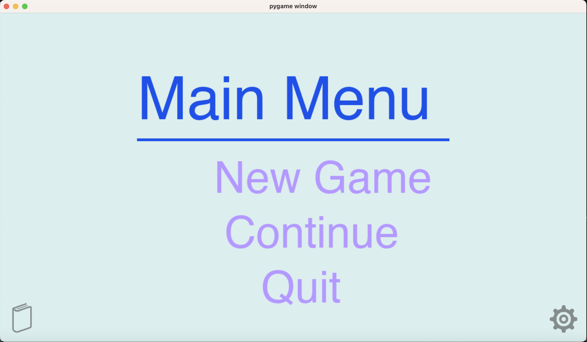
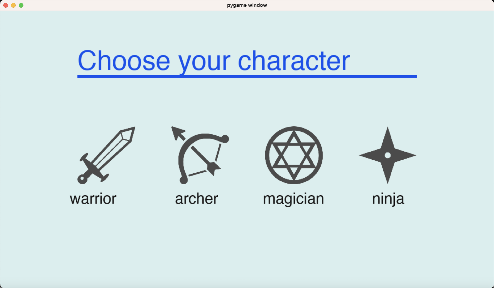
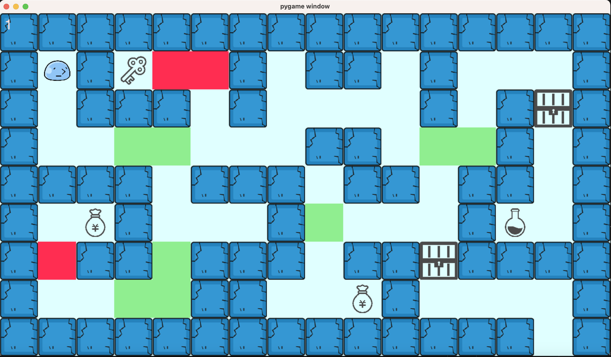
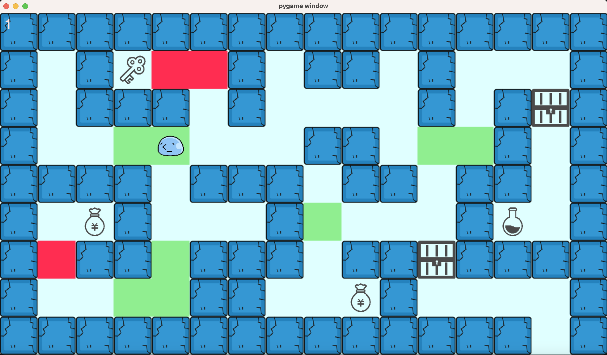
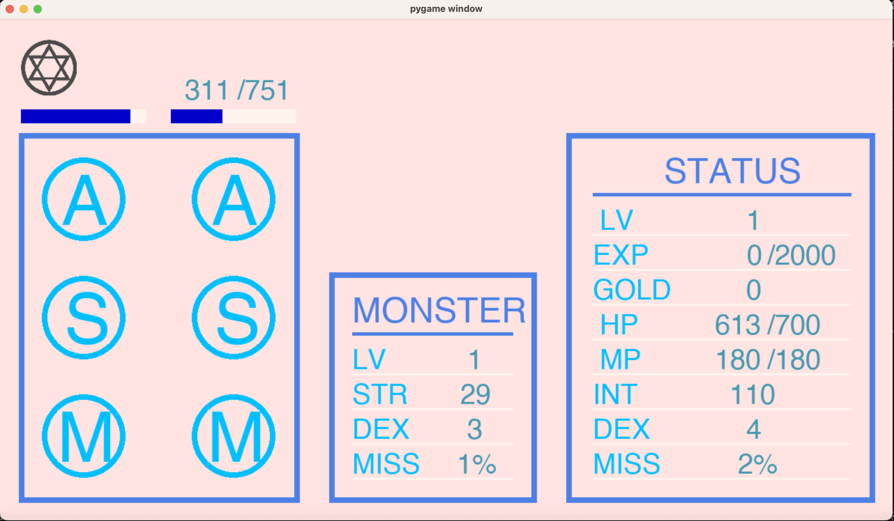

# Tower-of-the-Sorcerer
This project was made in 2019 by three authors including me. It's about a game like tower of the scrcerer(魔塔). For simplicity, we just did something and used a simple interface.

This is the menu of this game. But I remember that the continue doesn't work.

When you click new game, you would see this interface. You can choose four roles here.

After creating a role, your interface would be as follow.

And you can use "w, a, s, or d" to go to where you want.

When going on the green part, you may meet a monster. You can beat the monster, get experience, and try to level up.

